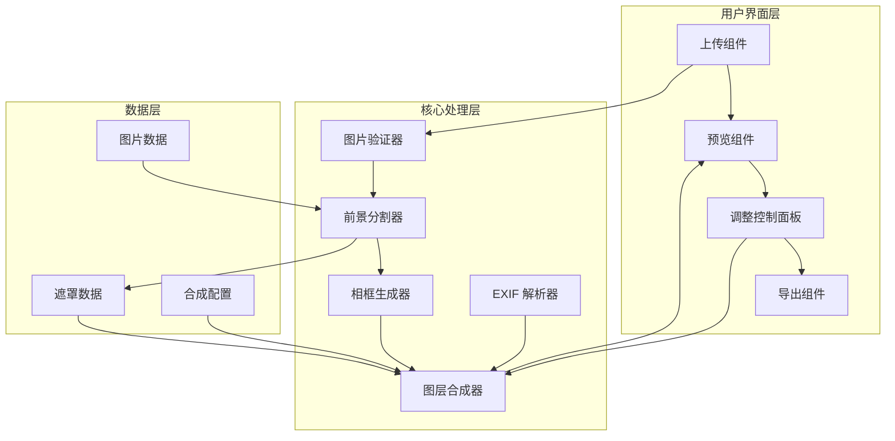
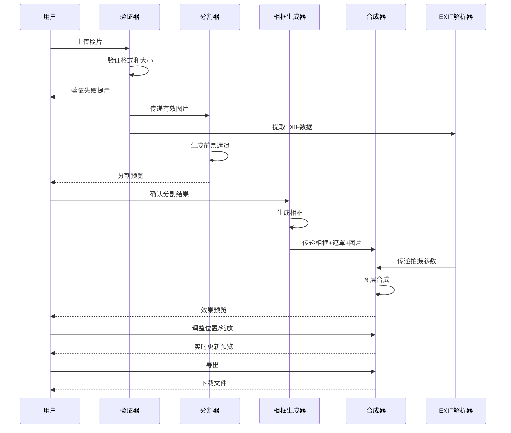

# 技术设计文档：照片出框效果（Photo Pop-Out Frame）

## 概述

照片出框效果是一个基于浏览器的前端应用，使用 HTML5 Canvas 实现照片主体从宝丽来风格相框中"跃出"的 3D 视觉效果。系统核心流程为：用户上传照片 → 前景主体分割 → 相框生成 → 图层合成 → 效果预览与调整 → 导出。

前景主体分割采用 TensorFlow.js 的 BodyPix 或 MediaPipe 的 Image Segmentation 模型，在浏览器端完成推理，无需后端服务。图层合成通过 Canvas 2D API 按固定顺序绘制，利用遮罩裁剪实现出框效果。

### 关键技术决策

| 决策 | 选择 | 理由 |
|------|------|------|
| 运行环境 | 纯前端（浏览器） | 无需后端部署，降低复杂度 |
| 图像分割 | @mediapipe/tasks-vision (Image Segmentation) | 浏览器端推理，精度高，支持细粒度分割 |
| 渲染引擎 | HTML5 Canvas 2D | 原生支持，图层合成灵活 |
| 框架 | TypeScript + Vite | 类型安全，构建快速 |
| EXIF 解析 | exifreader 库 | 轻量，支持主流 EXIF 标签 |
| UI 框架 | 原生 DOM + CSS | 保持轻量，减少依赖 |

## 架构

### 系统架构图



### 处理流程



## 组件与接口

### 1. ImageValidator（图片验证器）

负责验证上传文件的格式和大小。

```typescript
interface ImageValidator {
  /**
   * 验证上传的文件是否符合要求
   * @param file 用户上传的文件
   * @returns 验证结果，包含是否通过和错误信息
   */
  validate(file: File): ValidationResult;
}

interface ValidationResult {
  valid: boolean;
  error?: ValidationError;
}

type ValidationError = 
  | { type: 'invalid_format'; supportedFormats: string[] }
  | { type: 'file_too_large'; maxSizeMB: number }
  | { type: 'file_empty' };

```

### 2. ForegroundSegmenter（前景分割器）

使用 MediaPipe Image Segmentation 在浏览器端执行前景主体分割。

```typescript
interface ForegroundSegmenter {
  /**
   * 初始化分割模型
   */
  initialize(): Promise<void>;

  /**
   * 对图片执行前景分割
   * @param image 输入图片（HTMLImageElement 或 ImageBitmap）
   * @returns 分割结果，包含前景遮罩
   */
  segment(image: HTMLImageElement | ImageBitmap): Promise<SegmentationResult>;

  /**
   * 释放模型资源
   */
  dispose(): void;
}

interface SegmentationResult {
  /** 前景遮罩，与原图同尺寸的灰度 ImageData */
  mask: ImageData;
  /** 是否成功识别到前景主体 */
  hasSubject: boolean;
  /** 主体在原图中的边界框 */
  subjectBounds: BoundingBox;
}

interface BoundingBox {
  x: number;
  y: number;
  width: number;
  height: number;
}
```

### 3. FrameGenerator（相框生成器）

生成宝丽来风格的相框。

```typescript
interface FrameGenerator {
  /**
   * 根据照片尺寸和配置生成相框
   * @param photoSize 照片的宽高
   * @param config 相框配置
   * @returns 相框渲染参数
   */
  generateFrame(photoSize: Size, config: FrameConfig): FrameLayout;
}

interface Size {
  width: number;
  height: number;
}

interface FrameConfig {
  /** 边框宽度（像素），默认 40 */
  borderWidth: number;
  /** 底部额外宽度（用于展示参数），默认 100 */
  bottomPadding: number;
  /** 相框颜色，默认白色 */
  frameColor: string;
}

interface FrameLayout {
  /** 相框外部总尺寸 */
  outerSize: Size;
  /** 照片在相框内的绘制区域 */
  photoRect: Rect;
  /** 参数文字区域 */
  metadataRect: Rect;
  /** 相框边框路径（用于 Canvas 绘制） */
  framePath: Path2D;
}

interface Rect {
  x: number;
  y: number;
  width: number;
  height: number;
}
```

### 4. Compositor（图层合成器）

核心模块，按正确顺序合成所有图层并实现出框效果。

```typescript
interface Compositor {
  /**
   * 合成所有图层，生成最终效果图
   * @param params 合成参数
   * @returns 合成后的 Canvas
   */
  compose(params: CompositeParams): HTMLCanvasElement;

  /**
   * 导出合成结果为图片文件
   * @param canvas 合成后的 Canvas
   * @param format 导出格式
   * @param quality JPEG 质量（0-1）
   * @returns 图片 Blob
   */
  export(canvas: HTMLCanvasElement, format: ExportFormat, quality?: number): Promise<Blob>;
}

interface CompositeParams {
  /** 原始照片 */
  photo: HTMLImageElement;
  /** 前景遮罩 */
  mask: ImageData;
  /** 相框布局 */
  frameLayout: FrameLayout;
  /** 背景颜色 */
  backgroundColor: string;
  /** 照片在相框内的偏移量 */
  photoOffset: { x: number; y: number };
  /** 照片缩放比例 */
  photoScale: number;
  /** 拍摄参数文字 */
  metadataText: string;
}

type ExportFormat = 'png' | 'jpeg';
```

### 5. ExifParser（EXIF 解析器）

从照片文件中提取拍摄参数。

```typescript
interface ExifParser {
  /**
   * 从文件中解析 EXIF 数据
   * @param file 照片文件
   * @returns 解析后的拍摄参数
   */
  parse(file: File): Promise<ExifData>;

  /**
   * 将 EXIF 数据格式化为展示文字
   * @param data EXIF 数据
   * @returns 格式化后的文字
   */
  formatForDisplay(data: ExifData): string;
}

interface ExifData {
  /** 设备型号 */
  cameraModel: string | null;
  /** ISO 感光度 */
  iso: number | null;
  /** 光圈值 */
  aperture: number | null;
  /** 快门速度（如 "1/250"） */
  shutterSpeed: string | null;
  /** 焦距（mm） */
  focalLength: number | null;
  /** 拍摄日期 */
  dateTime: string | null;
}
```

## 数据模型

### 应用状态

```typescript
interface AppState {
  /** 当前处理阶段 */
  stage: ProcessStage;
  /** 原始照片文件 */
  originalFile: File | null;
  /** 原始照片 HTMLImageElement */
  originalImage: HTMLImageElement | null;
  /** 分割结果 */
  segmentation: SegmentationResult | null;
  /** 相框配置 */
  frameConfig: FrameConfig;
  /** 相框布局 */
  frameLayout: FrameLayout | null;
  /** EXIF 数据 */
  exifData: ExifData | null;
  /** 用户自定义的参数展示文字 */
  customMetadataText: string | null;
  /** 照片位置偏移 */
  photoOffset: { x: number; y: number };
  /** 照片缩放比例 */
  photoScale: number;
  /** 背景颜色 */
  backgroundColor: string;
  /** 导出格式 */
  exportFormat: ExportFormat;
  /** 错误信息 */
  error: string | null;
}

type ProcessStage =
  | 'upload'       // 等待上传
  | 'validating'   // 验证中
  | 'segmenting'   // 分割中
  | 'preview'      // 分割预览
  | 'composing'    // 合成中
  | 'adjusting'    // 调整中
  | 'exporting';   // 导出中
```

### 默认配置

```typescript
const DEFAULT_CONFIG = {
  /** 支持的文件格式 */
  SUPPORTED_FORMATS: ['image/jpeg', 'image/png', 'image/webp'] as const,
  /** 最大文件大小（字节） */
  MAX_FILE_SIZE: 20 * 1024 * 1024, // 20MB
  /** 默认边框宽度 */
  DEFAULT_BORDER_WIDTH: 40,
  /** 默认底部留白 */
  DEFAULT_BOTTOM_PADDING: 100,
  /** 默认相框颜色 */
  DEFAULT_FRAME_COLOR: '#FFFFFF',
  /** 默认背景颜色 */
  DEFAULT_BG_COLOR: '#1a1a2e',
  /** 默认缩放比例 */
  DEFAULT_SCALE: 1.0,
  /** 默认导出格式 */
  DEFAULT_EXPORT_FORMAT: 'png' as ExportFormat,
} as const;
```

### 图层合成顺序

合成器按以下固定顺序绘制图层（从底到顶）：

1. **背景层**：纯色背景，填充整个画布
2. **相框层**：白色宝丽来风格边框
3. **照片层**：原始照片，裁剪到相框内部区域（使用 `clip()` 限制绘制范围）
4. **出框主体层**：使用前景遮罩提取的主体部分，仅绘制超出相框上边界的区域

出框效果的关键实现：
- 第 3 层（照片层）使用 Canvas `clip()` 将绘制范围限制在相框内部
- 第 4 层（出框主体层）不设置 clip，使用遮罩将主体绘制在相框之上
- 通过遮罩的 alpha 通道实现边缘抗锯齿和自然过渡


## 正确性属性（Correctness Properties）

*属性是指在系统所有有效执行中都应保持为真的特征或行为——本质上是关于系统应该做什么的形式化陈述。属性是人类可读规格说明与机器可验证正确性保证之间的桥梁。*

### 属性 1：文件验证正确性

*对于任意*文件，验证函数应当：当文件 MIME 类型不在 `['image/jpeg', 'image/png', 'image/webp']` 中时返回 `invalid_format` 错误；当文件大小超过 20MB 时返回 `file_too_large` 错误；当且仅当格式和大小都合法时返回 `valid: true`。错误类型应与具体的失败原因精确匹配。

**验证需求：1.2, 1.3, 1.4**

### 属性 2：遮罩尺寸一致性

*对于任意*输入图片，前景分割器生成的遮罩（mask）的宽度和高度应与输入图片的宽度和高度完全一致。

**验证需求：2.2**

### 属性 3：无主体时的检测反馈

*对于任意*分割结果，当 `hasSubject` 为 `false` 时，系统应产生明确的错误提示，阻止进入合成阶段。

**验证需求：2.4**

### 属性 4：相框布局计算正确性

*对于任意*照片尺寸 `(w, h)` 和相框配置 `FrameConfig`，生成的 `FrameLayout` 应满足：
- `photoRect` 的宽高比与原始照片的宽高比一致（误差 < 0.01）
- `outerSize.width` = `photoRect.width` + 2 × `borderWidth`
- `outerSize.height` = `photoRect.height` + `borderWidth` + `bottomPadding`
- `metadataRect.height` 等于 `bottomPadding` 减去合理的内边距

**验证需求：3.1, 3.2, 3.3**

### 属性 5：出框效果图层合成正确性

*对于任意*合成参数（包含照片、遮罩、相框布局和背景颜色），合成结果应满足：
- 在相框上边界之上的区域，若遮罩标记为前景（alpha > 0），则该像素应来自主体图像而非相框颜色
- 在相框内部区域，照片像素应正常显示
- 在相框外部且非出框区域，像素应为指定的背景颜色
- 出框主体的 alpha 通道应保留遮罩中的渐变信息（非二值化）

**验证需求：4.1, 4.2, 4.5, 3.4**

### 属性 6：EXIF 格式化完整性

*对于任意* `ExifData` 对象，若其中某个字段（如 `cameraModel`、`iso`、`aperture`、`shutterSpeed`）为非 null 值，则 `formatForDisplay` 的输出字符串应包含该字段值的字符串表示。

**验证需求：5.2**

### 属性 7：导出格式与分辨率正确性

*对于任意*合成后的 Canvas 和导出格式，导出函数应生成对应 MIME 类型的 Blob（PNG 为 `image/png`，JPEG 为 `image/jpeg`），且导出图片的像素尺寸不小于原始照片的像素尺寸。

**验证需求：6.1, 6.2, 6.3**

### 属性 8：缩放比例应用正确性

*对于任意*照片原始尺寸 `(w, h)` 和缩放比例 `scale`，合成时照片的实际绘制尺寸应为 `(w × scale, h × scale)`。

**验证需求：7.2**

### 属性 9：重置恢复默认值

*对于任意*已调整的应用状态（photoOffset 和 photoScale 已被用户修改），执行重置操作后，`photoOffset` 应恢复为系统自动计算的默认值，`photoScale` 应恢复为 `DEFAULT_SCALE`。

**验证需求：7.4**

## 错误处理

### 错误分类与处理策略

| 错误场景 | 错误类型 | 处理方式 |
|----------|----------|----------|
| 文件格式不支持 | `ValidationError.invalid_format` | 显示支持格式列表，阻止上传 |
| 文件过大 | `ValidationError.file_too_large` | 显示大小限制，阻止上传 |
| 空文件 | `ValidationError.file_empty` | 显示错误提示 |
| 分割模型加载失败 | `SegmentationError.model_load_failed` | 显示重试按钮，提示检查网络 |
| 无法识别前景主体 | `SegmentationError.no_subject` | 提示用户更换照片 |
| Canvas 创建失败 | `CompositeError.canvas_failed` | 提示浏览器不支持或内存不足 |
| EXIF 解析失败 | 静默处理 | 使用默认占位文字，不影响主流程 |
| 导出失败 | `ExportError.blob_failed` | 显示重试按钮 |

### 错误处理原则

1. **用户友好**：所有面向用户的错误信息使用中文，清晰说明问题和解决方案
2. **非阻塞**：EXIF 解析等非关键步骤的失败不应阻塞主流程
3. **可恢复**：提供重试机制，允许用户从错误状态恢复
4. **日志记录**：在控制台记录详细错误信息，便于调试

## 测试策略

### 双重测试方法

本项目采用单元测试与属性测试相结合的方式，确保全面覆盖。

#### 属性测试（Property-Based Testing）

- **测试库**：使用 [fast-check](https://github.com/dubzzz/fast-check) 作为属性测试框架
- **最低迭代次数**：每个属性测试至少运行 100 次
- **标签格式**：每个测试用注释标注对应的设计属性
  - 格式：`Feature: photo-pop-out-frame, Property {number}: {property_text}`
- **每个正确性属性对应一个属性测试**

属性测试覆盖范围：
- 属性 1：文件验证正确性 — 生成随机文件元数据（格式、大小），验证验证逻辑
- 属性 2：遮罩尺寸一致性 — 生成随机尺寸，验证遮罩输出尺寸
- 属性 3：无主体检测反馈 — 生成 hasSubject=false 的分割结果，验证错误提示
- 属性 4：相框布局计算 — 生成随机照片尺寸和配置，验证布局计算
- 属性 5：出框效果合成 — 生成随机合成参数，验证像素级合成正确性
- 属性 6：EXIF 格式化 — 生成随机 ExifData，验证格式化输出
- 属性 7：导出格式与分辨率 — 生成随机 Canvas 和格式，验证 Blob 类型和尺寸
- 属性 8：缩放比例应用 — 生成随机尺寸和比例，验证绘制尺寸
- 属性 9：重置恢复默认值 — 生成随机调整状态，验证重置结果

#### 单元测试

- **测试框架**：Vitest
- **覆盖范围**：
  - 具体示例：验证特定文件格式的验证结果、特定 EXIF 数据的格式化输出
  - 边界情况：空文件、全 null 的 EXIF 数据、缩放比例为 0 或极大值
  - 集成测试：端到端的上传→分割→合成→导出流程
  - 错误条件：各种错误场景的处理逻辑

#### 测试文件结构

```
tests/
├── unit/
│   ├── image-validator.test.ts    // 图片验证器单元测试
│   ├── frame-generator.test.ts    // 相框生成器单元测试
│   ├── exif-parser.test.ts        // EXIF 解析器单元测试
│   └── compositor.test.ts         // 合成器单元测试
└── property/
    ├── validation.property.test.ts   // 属性 1: 文件验证
    ├── segmentation.property.test.ts // 属性 2, 3: 分割相关
    ├── frame.property.test.ts        // 属性 4: 相框布局
    ├── composite.property.test.ts    // 属性 5, 8: 合成相关
    ├── exif.property.test.ts         // 属性 6: EXIF 格式化
    ├── export.property.test.ts       // 属性 7: 导出
    └── state.property.test.ts        // 属性 9: 状态重置
```
